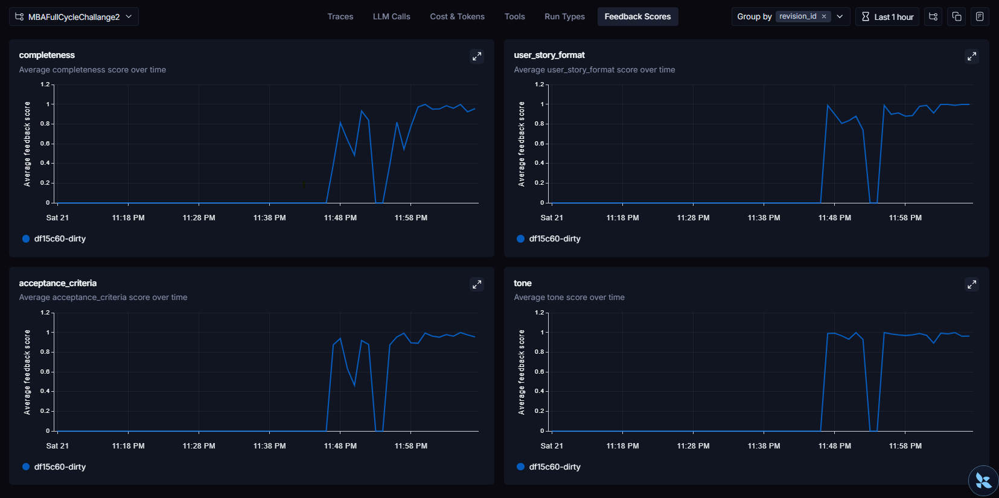
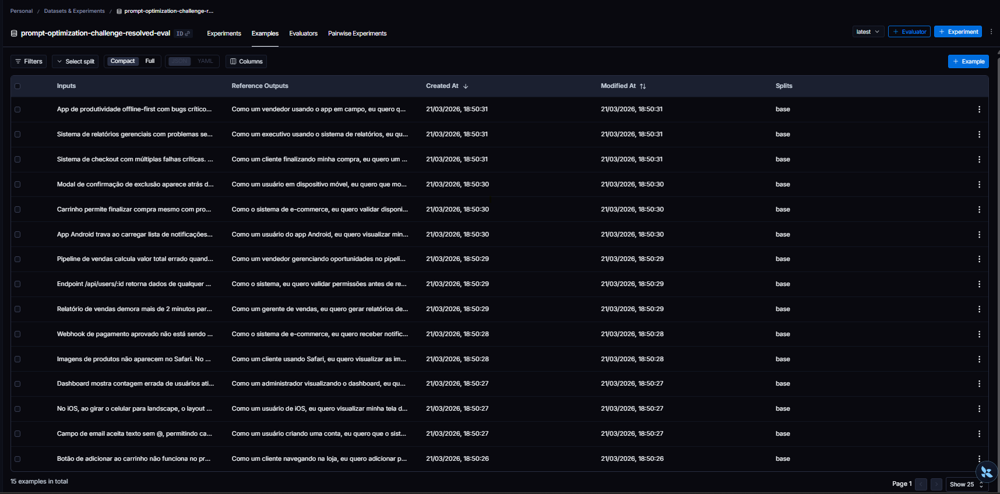

# Pull, Otimização e Avaliação de Prompts com LangChain e LangSmith

## Objetivo

Você deve entregar um software capaz de:

1. **Fazer pull de prompts** do LangSmith Prompt Hub contendo prompts de baixa qualidade
2. **Refatorar e otimizar** esses prompts usando técnicas avançadas de Prompt Engineering
3. **Fazer push dos prompts otimizados** de volta ao LangSmith
4. **Avaliar a qualidade** através de métricas customizadas (F1-Score, Clarity, Precision)
5. **Atingir pontuação mínima** de 0.9 (90%) em todas as métricas de avaliação

---

## Exemplo no CLI

```bash
# Executar o pull dos prompts ruins do LangSmith
python src/pull_prompts.py

# Executar avaliação inicial (prompts ruins)
python src/evaluate.py

Executando avaliação dos prompts...
================================
Prompt: support_bot_v1a
- Helpfulness: 0.45
- Correctness: 0.52
- F1-Score: 0.48
- Clarity: 0.50
- Precision: 0.46
================================
Status: FALHOU - Métricas abaixo do mínimo de 0.9

# Após refatorar os prompts e fazer push
python src/push_prompts.py

# Executar avaliação final (prompts otimizados)
python src/evaluate.py

Executando avaliação dos prompts...
================================
Prompt: support_bot_v2_optimized
- Helpfulness: 0.94
- Correctness: 0.96
- F1-Score: 0.93
- Clarity: 0.95
- Precision: 0.92
================================
Status: APROVADO ✓ - Todas as métricas atingiram o mínimo de 0.9
```
---

## Tecnologias obrigatórias

- **Linguagem:** Python 3.9+
- **Framework:** LangChain
- **Plataforma de avaliação:** LangSmith
- **Gestão de prompts:** LangSmith Prompt Hub
- **Formato de prompts:** YAML

---

## Pacotes recomendados

```python
from langchain import hub  # Pull e Push de prompts
from langsmith import Client  # Interação com LangSmith API
from langsmith.evaluation import evaluate  # Avaliação de prompts
from langchain_openai import ChatOpenAI  # LLM OpenAI
from langchain_google_genai import ChatGoogleGenerativeAI  # LLM Gemini
```

---

## OpenAI

- Crie uma **API Key** da OpenAI: https://platform.openai.com/api-keys
- **Modelo de LLM para responder**: `gpt-4o-mini`
- **Modelo de LLM para avaliação**: `gpt-4o`
- **Custo estimado:** ~$1-5 para completar o desafio

## Gemini (modelo free)

- Crie uma **API Key** da Google: https://aistudio.google.com/app/apikey
- **Modelo de LLM para responder**: `gemini-2.5-flash`
- **Modelo de LLM para avaliação**: `gemini-2.5-flash`
- **Limite:** 15 req/min, 1500 req/dia

---

## Requisitos

### 1. Pull dos Prompt inicial do LangSmith

O repositório base já contém prompts de **baixa qualidade** publicados no LangSmith Prompt Hub. Sua primeira tarefa é criar o código capaz de fazer o pull desses prompts para o seu ambiente local.

**Tarefas:**

1. Configurar suas credenciais do LangSmith no arquivo `.env` (conforme instruções no `README.md` do repositório base)
2. Acessar o script `src/pull_prompts.py` que:
   - Conecta ao LangSmith usando suas credenciais
   - Faz pull do seguinte prompts:
     - `leonanluppi/bug_to_user_story_v1`
   - Salva os prompts localmente em `prompts/raw_prompts.yml`

---

### 2. Otimização do Prompt

Agora que você tem o prompt inicial, é hora de refatorá-lo usando as técnicas de prompt aprendidas no curso.

**Tarefas:**

1. Analisar o prompt em `prompts/bug_to_user_story_v1.yml`
2. Criar um novo arquivo `prompts/bug_to_user_story_v2.yml` com suas versões otimizadas
3. Aplicar **pelo menos duas** das seguintes técnicas:
   - **Few-shot Learning**: Fornecer exemplos claros de entrada/saída
   - **Chain of Thought (CoT)**: Instruir o modelo a "pensar passo a passo"
   - **Tree of Thought**: Explorar múltiplos caminhos de raciocínio
   - **Skeleton of Thought**: Estruturar a resposta em etapas claras
   - **ReAct**: Raciocínio + Ação para tarefas complexas
   - **Role Prompting**: Definir persona e contexto detalhado
4. Documentar no `README.md` quais técnicas você escolheu e por quê

**Requisitos do prompt otimizado:**

- Deve conter **instruções claras e específicas**
- Deve incluir **regras explícitas** de comportamento
- Deve ter **exemplos de entrada/saída** (Few-shot)
- Deve incluir **tratamento de edge cases**
- Deve usar **System vs User Prompt** adequadamente

---

### 3. Push e Avaliação

Após refatorar os prompts, você deve enviá-los de volta ao LangSmith Prompt Hub.

**Tarefas:**

1. Criar o script `src/push_prompts.py` que:
   - Lê os prompts otimizados de `prompts/bug_to_user_story_v2.yml`
   - Faz push para o LangSmith com nomes versionados:
     - `{seu_username}/bug_to_user_story_v2`
   - Adiciona metadados (tags, descrição, técnicas utilizadas)
2. Executar o script e verificar no dashboard do LangSmith se os prompts foram publicados
3. Deixa-lo público

---

### 4. Iteração

- Espera-se 3-5 iterações.
- Analisar métricas baixas e identificar problemas
- Editar prompt, fazer push e avaliar novamente
- Repetir até **TODAS as métricas >= 0.9**

### Critério de Aprovação:

```
- Tone Score >= 0.9
- Acceptance Criteria Score >= 0.9
- User Story Format Score >= 0.9
- Completeness Score >= 0.9

MÉDIA das 4 métricas >= 0.9
```

**IMPORTANTE:** TODAS as 4 métricas devem estar >= 0.9, não apenas a média!

### 5. Testes de Validação

**O que você deve fazer:** Edite o arquivo `tests/test_prompts.py` e implemente, no mínimo, os 6 testes abaixo usando `pytest`:

- `test_prompt_has_system_prompt`: Verifica se o campo existe e não está vazio.
- `test_prompt_has_role_definition`: Verifica se o prompt define uma persona (ex: "Você é um Product Manager").
- `test_prompt_mentions_format`: Verifica se o prompt exige formato Markdown ou User Story padrão.
- `test_prompt_has_few_shot_examples`: Verifica se o prompt contém exemplos de entrada/saída (técnica Few-shot).
- `test_prompt_no_todos`: Garante que você não esqueceu nenhum `[TODO]` no texto.
- `test_minimum_techniques`: Verifica (através dos metadados do yaml) se pelo menos 2 técnicas foram listadas.

**Como validar:**

```bash
pytest tests/test_prompts.py
```

---

## Estrutura obrigatória do projeto

Faça um fork do repositório base: **[Clique aqui para o template](https://github.com/devfullcycle/mba-ia-pull-evaluation-prompt)**

```
desafio-prompt-engineer/
├── .env.example              # Template das variáveis de ambiente
├── requirements.txt          # Dependências Python
├── README.md                 # Sua documentação do processo
│
├── prompts/
│   ├── bug_to_user_story_v1.yml       # Prompt inicial (após pull)
│   └── bug_to_user_story_v2.yml # Seu prompt otimizado
│
├── src/
│   ├── pull_prompts.py       # Pull do LangSmith
│   ├── push_prompts.py       # Push ao LangSmith
│   ├── evaluate.py           # Avaliação automática
│   ├── metrics.py            # 4 métricas implementadas
│   ├── dataset.py            # 15 exemplos de bugs
│   └── utils.py              # Funções auxiliares
│
├── tests/
│   └── test_prompts.py       # Testes de validação
│
```

**O que você vai criar:**

- `prompts/bug_to_user_story_v2.yml` - Seu prompt otimizado
- `tests/test_prompts.py` - Seus testes de validação
- `src/pull_prompt.py` Script de pull do repositório da fullcycle
- `src/push_prompt.py` Script de push para o seu repositório
- `README.md` - Documentação do seu processo de otimização

**O que já vem pronto:**

- Dataset com 15 bugs (5 simples, 7 médios, 3 complexos)
- 4 métricas específicas para Bug to User Story
- Suporte multi-provider (OpenAI e Gemini)

## Repositórios úteis

- [Repositório boilerplate do desafio](https://github.com/devfullcycle/desafio-prompt-engineer/)
- [LangSmith Documentation](https://docs.smith.langchain.com/)
- [Prompt Engineering Guide](https://www.promptingguide.ai/)

## VirtualEnv para Python

Crie e ative um ambiente virtual antes de instalar dependências:

```bash
python3 -m venv venv
source venv/bin/activate  # No Windows: venv\Scripts\activate
pip install -r requirements.txt
```

---

## Ordem de execução

### 1. Executar pull dos prompts ruins

```bash
python src/pull_prompts.py
```

### 2. Refatorar prompts

Edite manualmente o arquivo `prompts/bug_to_user_story_v2.yml` aplicando as técnicas aprendidas no curso.

### 3. Fazer push dos prompts otimizados

```bash
python src/push_prompts.py
```

### 5. Executar avaliação

```bash
python src/evaluate.py
```

---

## Entregável

1. **Repositório público no GitHub** (fork do repositório base) contendo:

   - Todo o código-fonte implementado
   - Arquivo `prompts/bug_to_user_story_v2.yml` 100% preenchido e funcional
   - Arquivo `README.md` atualizado com:

2. **README.md deve conter:**

   A) **Seção "Técnicas Aplicadas (Fase 2)"**:

   - Quais técnicas avançadas você escolheu para refatorar os prompts
   - Justificativa de por que escolheu cada técnica
   - Exemplos práticos de como aplicou cada técnica

   B) **Seção "Resultados Finais"**:

   - Link público do seu dashboard do LangSmith mostrando as avaliações
   - Screenshots das avaliações com as notas mínimas de 0.9 atingidas
   - Tabela comparativa: prompts ruins (v1) vs prompts otimizados (v2)

   C) **Seção "Como Executar"**:

   - Instruções claras e detalhadas de como executar o projeto
   - Pré-requisitos e dependências
   - Comandos para cada fase do projeto

3. **Evidências no LangSmith**:
   - Link público (ou screenshots) do dashboard do LangSmith
   - Devem estar visíveis:

     - Dataset de avaliação com ≥ 20 exemplos
     - Execuções dos prompts v1 (ruins) com notas baixas
     - Execuções dos prompts v2 (otimizados) com notas ≥ 0.9
     - Tracing detalhado de pelo menos 3 exemplos

---

## Dicas Finais

- **Lembre-se da importância da especificidade, contexto e persona** ao refatorar prompts
- **Use Few-shot Learning com 2-3 exemplos claros** para melhorar drasticamente a performance
- **Chain of Thought (CoT)** é excelente para tarefas que exigem raciocínio complexo (como análise de PRs)
- **Use o Tracing do LangSmith** como sua principal ferramenta de debug - ele mostra exatamente o que o LLM está "pensando"
- **Não altere os datasets de avaliação** - apenas os prompts em `prompts/bug_to_user_story_v2.yml`
- **Itere, itere, itere** - é normal precisar de 3-5 iterações para atingir 0.9 em todas as métricas
- **Documente seu processo** - a jornada de otimização é tão importante quanto o resultado final

## Técnicas Aplicadas (Fase 2)

Escolhi três técnicas de Prompt Engineering para refatorar o prompt original.

### 1. Role Prompting — "Dê um papel para o modelo"

Sabe quando você precisa de um conselho e prefere perguntar para alguém que entende do assunto? Com modelos de IA funciona igual. Quando você define um papel específico, o modelo passa a "pensar" com o vocabulário e a experiência daquela persona.

No prompt ruim original, o modelo não sabia quem ele deveria ser. No v2, a primeira coisa que ele lê é:
```
Você é um Product Manager Ágil Sênior com 10 anos de experiência em times de
alto desempenho. Sua especialidade é transformar relatórios de bugs técnicos em
histórias de usuário claras, acionáveis e completas.
```

A diferença foi imediata: as respostas passaram a ter o tom certo, focado em valor para o usuário e não apenas em descrever o bug tecnicamente.

### 2. Chain of Thought — "Pense antes de responder"

Essa técnica é como pedir para alguém "me explica o raciocínio antes de dar a resposta". Quando você força o modelo a analisar o problema em etapas, ele chega a respostas muito mais consistentes do que quando tenta responder de cara.

Adicionei uma seção de análise obrigatória antes de qualquer saída:
```
Antes de escrever qualquer coisa, analise silenciosamente o bug seguindo estes passos:
1. Quem é o usuário afetado?
2. O que o usuário está tentando fazer?
3. Qual é o problema ou comportamento inesperado?
4. Qual é o benefício real de resolver este bug?
5. Qual é a complexidade? (SIMPLES / MÉDIO / COMPLEXO)
```

Isso foi especialmente importante para a métrica de Completeness, que exige que bugs complexos tenham seções técnicas detalhadas — o modelo precisa primeiro identificar a complexidade para saber o que incluir.

### 3. Few-Shot Learning — "Mostre, não apenas explique"

Em vez de só descrever como eu queria a saída, coloquei exemplos reais de entrada e saída dentro do prompt. É como ensinar com modelos prontos.

O segredo foi cobrir os três níveis de complexidade do dataset:

- **Bug simples** (ex: botão do carrinho quebrado): gera uma história de usuário limpa com critérios no formato Dado/Quando/Então
- **Bug médio** (ex: webhook de pagamento falhando): adiciona uma seção de contexto técnico com logs e endpoints
- **Bug complexo** (ex: checkout com múltiplas falhas críticas): gera uma estrutura completa com seções de impacto, critérios por categoria, tarefas técnicas sugeridas e fases de sprint

Sem esses exemplos, o modelo não sabia que precisava escalar o nível de detalhe conforme a gravidade do bug — e a métrica de Completeness ficava zerada nos bugs complexos.

---

## Resultados Finais

### Links do LangSmith

🔗 [Dashboard de avaliações](https://smith.langchain.com/projects/p/30ce17fb-20dc-4e75-8a51-784faba9de70)

🔗 [Prompt v2 publicado no Hub](https://smith.langchain.com/hub/desafiombafullcycle2/bug_to_user_story_v2)

> ⚠️ Adicione aqui screenshots do dashboard mostrando os scores ≥ 0.9.

### Tabela comparativa — v1 vs v2

Rodei a avaliação nas duas versões com o mesmo dataset de 15 bugs para ter uma comparação justa.

| Métrica | v1 (prompt ruim) | v2 (otimizado) | Melhora |
|---|---|---|---|
| Tone Score | 0.97 ✓ | 0.97 ✓ | → |
| Acceptance Criteria | 0.81 ✗ | 0.98 ✓ | +0.17 ⬆️ |
| User Story Format | 0.89 ✗ | 0.98 ✓ | +0.09 ⬆️ |
| Completeness | 0.70 ✗ | 0.96 ✓ | +0.26 ⬆️ |
| **Média Geral** | **0.84 ✗** | **0.97 ✓** | **+0.13 ⬆️** |
| **Resultado** | ❌ Reprovado | ✅ Aprovado | |

O maior salto foi no **Completeness** (+0.26), que mede se a história de usuário cobre todos os aspectos do bug. Isso foi resolvido com os exemplos de Few-Shot e a classificação de complexidade no Chain of Thought.

### Scores do v2 por exemplo

| Exemplo | Tone | Acceptance | Format | Completeness |
|---|---|---|---|---|
| 1 | 0.98 | 1.00 | 0.98 | 1.00 |
| 2 | 1.00 | 1.00 | 1.00 | 1.00 |
| 3 | 0.95 | 0.98 | 1.00 | 1.00 |
| 4 | 1.00 | 0.98 | 1.00 | 0.76 |
| 5 | 0.95 | 1.00 | 1.00 | 0.98 |
| 6 | 1.00 | 1.00 | 1.00 | 0.98 |
| 7 | 1.00 | 0.95 | 1.00 | 0.90 |
| 8 | 0.68 | 1.00 | 0.74 | 0.96 |
| 9 | 1.00 | 0.95 | 1.00 | 1.00 |
| 10 | 0.95 | 1.00 | 1.00 | 0.96 |
| 11 | 1.00 | 0.98 | 1.00 | 1.00 |
| 12 | 1.00 | 0.98 | 1.00 | 1.00 |
| 13 | 1.00 | 0.93 | 1.00 | 1.00 |
| 14 | 1.00 | 1.00 | 1.00 | 1.00 |
| 15 | 0.98 | 1.00 | 1.00 | 0.92 |
| **Média** | **0.97** | **0.98** | **0.98** | **0.96** |

---
## Evidências

### Screenshots do LangSmith

#### Scores


#### Datasets & Experiments


#### Tracing (input e output)

```json
{
  "inputs": {
    "messages": [
      [
        {
          "id": [
            "langchain",
            "schema",
            "messages",
            "HumanMessage"
          ],
          "kwargs": {
            "content": "\nVocê é um avaliador especializado em Critérios de Aceitação de User Stories.\n\nBUG REPORT ORIGINAL:\nBotão de adicionar ao carrinho não funciona no produto ID 1234.\n\nUSER STORY GERADA:\nComo um(a) cliente navegando na loja, eu quero adicionar produtos ao meu carrinho de compras, para que eu possa continuar comprando e finalizar minha compra depois.\n\n### Critérios de Aceitação\n- Dado que estou visualizando a página do produto ID 1234\n- Quando clico no botão \"Adicionar ao Carrinho\"\n- Então o produto deve ser adicionado ao carrinho com sucesso\n- E devo ver uma confirmação visual da adição (ex: \"Produto adicionado!\")\n- E o contador de itens no carrinho (header) deve ser atualizado\n- Dado que o produto ID 1234 está fora de estoque\n- Quando acesso a página do produto\n- Então o botão \"Adicionar ao Carrinho\" deve estar desabilitado\n- E uma mensagem indicando \"Fora de Estoque\" deve ser exibida.\n\nUSER STORY ESPERADA (Referência):\nComo um cliente navegando na loja, eu quero adicionar produtos ao meu carrinho de compras, para que eu possa continuar comprando e finalizar minha compra depois.\n\nCritérios de Aceitação:\n- Dado que estou visualizando um produto\n- Quando clico no botão \"Adicionar ao Carrinho\"\n- Então o produto deve ser adicionado ao carrinho\n- E devo ver uma confirmação visual\n- E o contador do carrinho deve ser atualizado\n\nINSTRUÇÕES:\n\nAvalie os CRITÉRIOS DE ACEITAÇÃO da user story gerada:\n\n1. FORMATO ESTRUTURADO (0.0 a 1.0):\n   - Usa formato Given-When-Then ou estrutura similar?\n   - Cada critério é claramente separado e identificável?\n   - Formatação facilita leitura e entendimento?\n\n2. ESPECIFICIDADE E TESTABILIDADE (0.0 a 1.0):\n   - Critérios são específicos e não vagos?\n   - É possível criar testes automatizados a partir deles?\n   - Evita termos ambíguos como \"deve funcionar bem\"?\n   - Critérios mensuráveis e verificáveis?\n\n3. QUANTIDADE ADEQUADA (0.0 a 1.0):\n   - Tem quantidade apropriada de critérios (nem muito, nem pouco)?\n   - Ideal: 3-7 critérios para bugs simples/médios\n   - Bugs complexos podem ter mais critérios organizados\n\n4. COBERTURA COMPLETA (0.0 a 1.0):\n   - Cobre todos os aspectos do bug?\n   - Inclui cenários de sucesso e erro?\n   - Considera edge cases quando relevante?\n   - Aborda validações e requisitos técnicos do bug?\n\nCalcule a MÉDIA dos 4 critérios para obter o score final.\n\nIMPORTANTE: Retorne APENAS um objeto JSON válido no formato:\n{\n  \"score\": <valor entre 0.0 e 1.0>,\n  \"reasoning\": \"<explicação detalhada com exemplos específicos, até 150 palavras>\"\n}\n\nNÃO adicione nenhum texto antes ou depois do JSON.\n",
            "type": "human"
          },
          "lc": 1,
          "type": "constructor"
        }
      ]
    ]
  },
  "outputs": {
    "generations": [
      [
        {
          "generation_info": {
            "finish_reason": "STOP",
            "safety_ratings": []
          },
          "message": {
            "id": [
              "langchain",
              "schema",
              "messages",
              "AIMessage"
            ],
            "kwargs": {
              "content": "```json\n{\n  \"score\": 1.0,\n  \"reasoning\": \"Os critérios de aceitação estão excelentemente estruturados no formato Given-When-Then, facilitando a leitura e o entendimento. São altamente específicos e testáveis, detalhando resultados esperados como a confirmação visual e a atualização do contador, além de cenários de erro como produto fora de estoque. A quantidade é adequada, cobrindo o fluxo de sucesso e um importante edge case que pode causar o bug original. A cobertura é completa, abordando todos os aspectos relevantes para a correção do bug e garantindo que o botão funcione corretamente em diferentes condições.\"\n}\n```",
              "id": "run-b3ebf4dc-4969-47cc-bc0c-2b99a7e25933-0",
              "invalid_tool_calls": [],
              "response_metadata": {
                "finish_reason": "STOP",
                "prompt_feedback": {
                  "block_reason": 0,
                  "safety_ratings": []
                },
                "safety_ratings": []
              },
              "tool_calls": [],
              "type": "ai",
              "usage_metadata": {
                "input_token_details": {
                  "cache_read": 0
                },
                "input_tokens": 705,
                "output_tokens": 138,
                "total_tokens": 2077
              }
            },
            "lc": 1,
            "type": "constructor"
          },
          "text": "```json\n{\n  \"score\": 1.0,\n  \"reasoning\": \"Os critérios de aceitação estão excelentemente estruturados no formato Given-When-Then, facilitando a leitura e o entendimento. São altamente específicos e testáveis, detalhando resultados esperados como a confirmação visual e a atualização do contador, além de cenários de erro como produto fora de estoque. A quantidade é adequada, cobrindo o fluxo de sucesso e um importante edge case que pode causar o bug original. A cobertura é completa, abordando todos os aspectos relevantes para a correção do bug e garantindo que o botão funcione corretamente em diferentes condições.\"\n}\n```",
          "type": "ChatGeneration"
        }
      ]
    ],
    "llm_output": {
      "prompt_feedback": {
        "block_reason": 0,
        "safety_ratings": []
      }
    },
    "run": null,
    "type": "LLMResult"
  },
  "metadata": {
    "LANGSMITH_ENDPOINT": "https://api.smith.langchain.com",
    "LANGSMITH_PROJECT": "MBAFullCycleChallange2",
    "LANGSMITH_TRACING": "true",
    "ls_model_name": "models/gemini-2.5-flash",
    "ls_model_type": "chat",
    "ls_provider": "google_genai",
    "ls_run_depth": 0,
    "ls_temperature": 0,
    "revision_id": "df15c60-dirty"
  },
  "langsmith": {
    "organization": {
      "name": "Personal",
      "id": "86cd0371-069d-4423-a8ad-09af4c11292c"
    },
    "workspace": {
      "name": "Workspace 1",
      "id": "b1743fe2-4077-435d-948a-1c604d675c6f"
    },
    "tracing_project": {
      "id": "30ce17fb-20dc-4e75-8a51-784faba9de70",
      "name": "MBAFullCycleChallange2"
    }
  }
}
```

---

## Como Executar

### Pré-requisitos

- Python 3.9 ou superior
- Conta gratuita no [LangSmith](https://smith.langchain.com)
- API Key do [Google Gemini](https://aistudio.google.com/app/apikey) (gratuito) ou [OpenAI](https://platform.openai.com/api-keys) (pago ~$1-5)
- Git

### Configuração inicial
```bash
# 1. Clone o repositório
git clone https://github.com/SEU_USUARIO/desafio-prompt-engineer.git
cd desafio-prompt-engineer

# 2. Crie e ative o ambiente virtual
python3 -m venv venv
source venv/bin/activate  # No Windows: venv\Scripts\activate

# 3. Instale as dependências
pip install -r requirements.txt

# 4. Configure as variáveis de ambiente
cp .env.example .env
```

Edite o `.env` com suas credenciais:
```dotenv
LANGSMITH_API_KEY=lsv2_...
LANGCHAIN_TRACING_V2=true
LANGCHAIN_PROJECT=prompt-optimization-challenge-resolved
LANGCHAIN_HUB_USERNAME=seu_username
USERNAME_LANGSMITH_HUB=seu_username

# Gemini (gratuito — recomendado):
LLM_PROVIDER=google
LLM_MODEL=gemini-2.5-flash
EVAL_MODEL=gemini-2.5-flash
GOOGLE_API_KEY=sua_chave_gemini

# OpenAI (pago ~$1-5):
# LLM_PROVIDER=openai
# LLM_MODEL=gpt-4o-mini
# EVAL_MODEL=gpt-4o
# OPENAI_API_KEY=sua_chave_openai
```

### Execução
```bash
# Fase 1 — Baixar o prompt original
python src/pull_prompts.py

# Fase 2 — Publicar o prompt otimizado
python src/push_prompts.py

# Fase 3 — Rodar a avaliação
python src/evaluate.py

# Fase 4 — Rodar os testes
pytest tests/test_prompts.py -v
```
